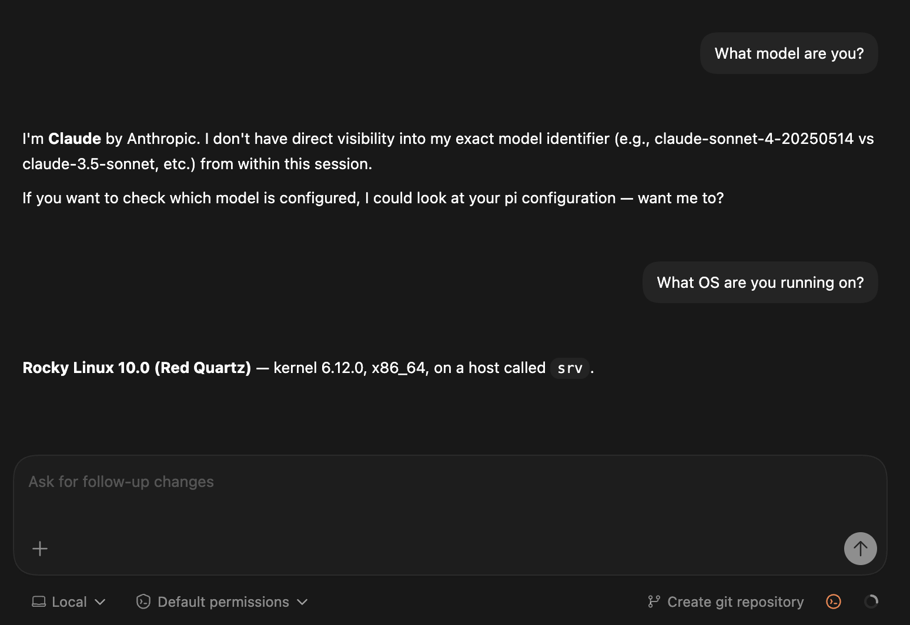
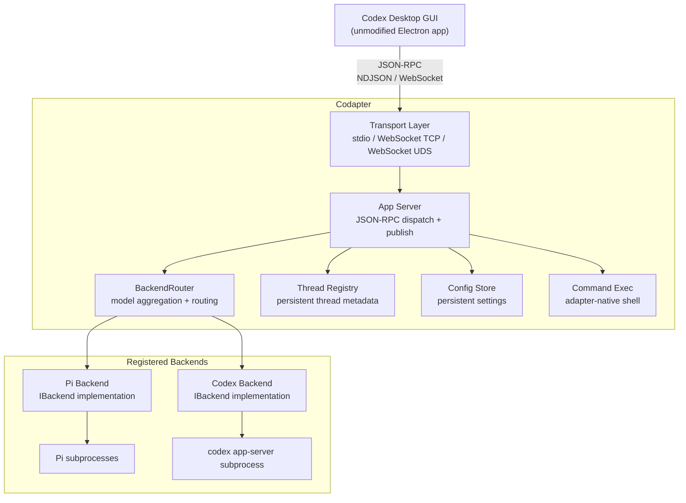
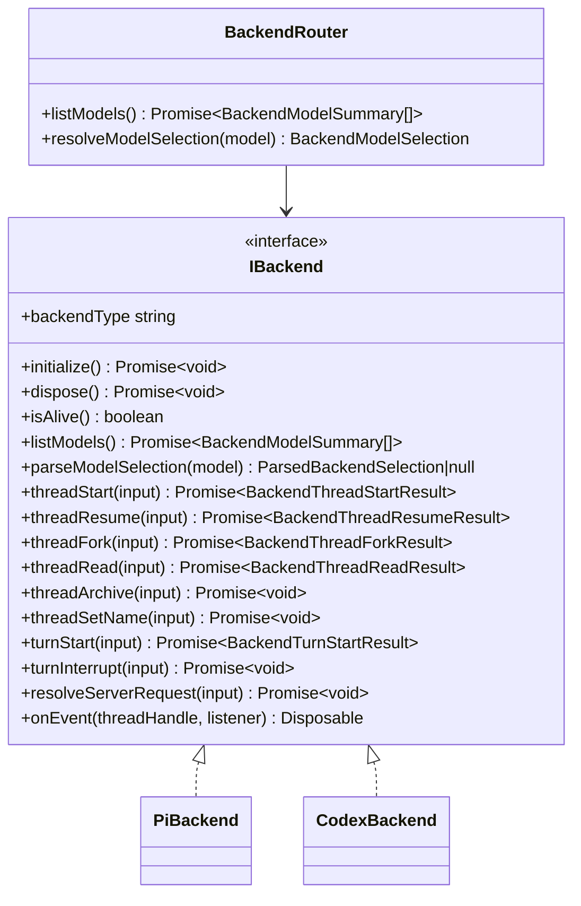

# Codapter

> **WIP / Prototype** — This project is an early-stage proof of concept. APIs, configuration, and behavior may change without notice. Not recommended for production use.

A protocol adapter that lets clients built around the Codex app-server protocol — including [Codex Desktop](https://developers.openai.com/codex/app), the Codex CLI, and third-party applications — work with alternative AI backends. There are a growing number of well-built clients that speak this protocol; codapter lets you plug any of them into supported alternative backends.



*Codex Desktop connected through codapter via routed backends.*

**Supported backends in this branch**:
- [Pi](https://github.com/badlogic/pi-mono) (`@mariozechner/pi-coding-agent`) with multi-provider LLM support.
- Codex app-server proxy backend over stdio.
- Backends are registered at startup by the CLI bootstrap. In this branch, Pi is required at startup and Codex is optional (disabled by `CODAPTER_CODEX_DISABLE` or skipped if unavailable).

**Codex websocket status**: websocket transport for the Codex backend is intentionally deferred in this topic. Current behavior is deterministic reject when `CODAPTER_CODEX_TRANSPORT=websocket` is selected. The next extension target is Codex backend websocket support.

## How It Works

Codapter implements the Codex app-server JSON-RPC protocol — the wire protocol that Codex Desktop and other clients use to communicate with a backend. Clients connect to codapter over stdio (local) or WebSocket (remote), and codapter translates every request into the target backend's native protocol.



## Quick Start

### Prerequisites

- **Node.js 22+** ([download](https://nodejs.org/))
- **Codex Desktop** installed ([download](https://developers.openai.com/codex/app))
- **[Pi coding agent](https://github.com/badlogic/pi-mono)** installed and configured with at least one LLM provider (see Pi documentation for setup)

### 1. Install & Build Codapter

```bash
git clone <repo-url> codapter
cd codapter
npm install
npm run build:dist
```

### 2. Run Locally

Point Codex Desktop at codapter:

```bash
export CODEX_CLI_PATH="$(pwd)/dist/codapter.mjs"
# Launch Codex Desktop — it will use codapter instead of the official CLI
```

Or run codapter directly for testing:

```bash
# Stdio mode (how Codex Desktop spawns it)
node dist/codapter.mjs app-server

# Stdio mode with collab sub-agent support enabled via env var
CODAPTER_COLLAB=1 node dist/codapter.mjs app-server

# WebSocket mode (for remote connections)
node dist/codapter.mjs app-server --listen ws://127.0.0.1:9234

# Unix domain socket mode (for containerized environments)
node dist/codapter.mjs app-server --listen unix:///tmp/codapter.sock

# Multiple listeners simultaneously
node dist/codapter.mjs app-server \
  --listen ws://127.0.0.1:9234 \
  --listen unix://$HOME/.codex/adapter.sock
```

### Build Distribution Binary

```bash
npm run build:dist
# Builds all packages and creates dist/codapter.mjs
```

## Architecture

### Transport Layer

Codapter supports three transport modes, all serving the same JSON-RPC protocol:

| Mode | Flag | Use Case |
|------|------|----------|
| **stdio** | *(default, no flag)* | Local mode — Codex Desktop spawns codapter as a child process |
| **WebSocket/TCP** | `--listen ws://host:port` | Remote mode — SSH tunnel to this endpoint |
| **WebSocket/UDS** | `--listen unix:///path/to/sock` | Container mode — SSH streamlocal forwarding |

The `CODAPTER_LISTEN` environment variable can be used instead of `--listen` flags (comma-separated for multiple listeners).

All WebSocket listeners serve the root `/` endpoint. Health checks are available at `/healthz` and `/readyz`.

### Request Lifecycle

Current routed lifecycle:

1. Client initializes the app-server connection (`initialize`, `initialized`).
2. `model/list` is aggregated across healthy registered backends (`BackendRouter`).
3. `thread/start` resolves the selected backend from the chosen model id. Pi models remain prefixed (`pi::...`); unprefixed ids route to Codex, and legacy `codex::...` ids are still accepted.
4. Thread metadata is stored in the registry with `{ backendType, backendSessionId }`.
5. `turn/start` routes to the owning backend thread handle.
6. Backend notifications/server-requests are relayed to the client through `AppServerConnection`.

### Thread & Session Model

Codapter maintains a **thread registry** as the single source of truth for thread identity and metadata.

**Storage**: `~/.local/share/codapter/threads.json` (atomic writes via temp file + rename)

**Key behaviors**:
- `thread/list` reads exclusively from the registry — never from the backend
- `thread/start` creates both a registry entry and an owning backend thread handle
- `thread/resume` reattaches using persisted `{ backendType, backendSessionId }`
- `thread/fork` creates a new registry entry and backend-owned forked thread handle
- `thread/archive` marks the thread in the registry and disposes the backend process

Detailed current architecture and contract docs live in:
- `docs/architecture.md`
- `docs/backend-interface.md`
- `docs/api-mapping.md`

### Command Execution

Standalone shell commands (`command/exec`) are handled **natively by the adapter** using Node.js `child_process`, not routed through the backend. This avoids blocking the backend's single-threaded session.

| Method | Description |
|--------|-------------|
| `command/exec` | Spawn process, buffer or stream output |
| `command/exec/write` | Write to process stdin (base64 encoded) |
| `command/exec/terminate` | Kill process with SIGTERM |

Output is capped at 1MB per stream by default (configurable via `outputBytesCap`). Streaming mode (`streamStdoutStderr: true`) sends `command/exec/outputDelta` notifications as data arrives.

> **Note**: PTY/TTY mode (`tty: true`) is not supported. The Codex Desktop GUI does not appear to use this mode.

## Configuration

### Environment Variables

| Variable | Description | Default |
|----------|-------------|---------|
| `CODEX_CLI_PATH` | Set this to codapter's path so Codex Desktop uses it | — |
| `CODAPTER_LISTEN` | Comma-separated listener URIs (alternative to `--listen`) | *(stdio)* |
| `CODAPTER_COLLAB` | Enable collab sub-agent support (alternative to `--collab`) | *(disabled)* |
| `CODAPTER_PI_COMMAND` | Override the command used to launch Pi | `npx` |
| `CODAPTER_PI_ARGS` | Override Pi launch args (JSON array string); `--session-dir` is always appended | `["--yes","@mariozechner/pi-coding-agent","--mode","rpc"]` |
| `CODAPTER_PI_IDLE_TIMEOUT_MS` | Idle timeout before Pi processes are gracefully stopped (ms; 0 disables) | `300000` (5 min) |
| `CODAPTER_CODEX_DISABLE` | Disable Codex backend registration at startup (`1`, `true`, `yes`, `on`) | *(enabled)* |
| `CODAPTER_CODEX_COMMAND` | Override the command used to launch Codex app-server | `codex` |
| `CODAPTER_CODEX_ARGS` | Override Codex launch args (JSON array string) | `["app-server"]` |
| `CODAPTER_CODEX_TRANSPORT` | Codex backend transport (`stdio` or `websocket`) | `stdio` |
| `CODAPTER_CODEX_WS_URL` | Codex websocket URL when websocket transport is selected | *(none)* |
| `CODAPTER_EMULATE_CODEX_IDENTITY` | User agent string returned in `initialize` | `codapter/<ADAPTER_VERSION>` |
| `CODAPTER_COLLAB_EXTENSION_PATH` | Override path to the collab extension script | *(built-in)* |
| `CODAPTER_DEBUG_LOG_FILE` | Path to JSONL debug log file | *(disabled)* |

### Config Store

The adapter maintains a config store that responds to `config/read` and `config/value/write` RPCs. Values are persisted to `~/.config/codapter/config.toml`, so settings like model selection and reasoning effort survive adapter restarts.

### Pi Backend Configuration

The Pi backend uses its own configuration at `~/.pi/agent/`:
- **API keys**: `~/.pi/agent/auth.json`
- **Sessions**: managed under `~/.local/share/codapter/backend-pi/`
- **Model selection**: all models configured in Pi are exposed through `model/list`

## Supported Codex RPC Methods

### Fully Implemented

| Method | Description |
|--------|-------------|
| `initialize` | Connection handshake with capabilities negotiation |
| `thread/start` | Create new conversation thread |
| `thread/resume` | Reconnect to existing thread |
| `thread/fork` | Clone thread at current state |
| `thread/read` | Read thread metadata and turn history |
| `thread/list` | List threads with filtering and pagination |
| `thread/loaded/list` | List currently loaded (active process) threads |
| `thread/name/set` | Rename a thread |
| `thread/archive` / `thread/unarchive` | Archive management |
| `thread/metadata/update` | Update git info |
| `thread/unsubscribe` | Stop notifications for a thread |
| `turn/start` | Send user message, stream response |
| `turn/interrupt` | Cancel in-progress turn |
| `model/list` | List available models from backend |
| `config/read` | Read adapter configuration |
| `config/value/write` / `config/batchWrite` | Write configuration (persisted to disk) |
| `configRequirements/read` | Returns null (no requirements) |
| `getAuthStatus` / `account/read` | Returns current adapter auth state (null, API key, or ChatGPT token identity) |
| `command/exec` | Execute shell commands (adapter-native) |
| `command/exec/write` | Write to process stdin |
| `command/exec/terminate` | Kill running process |
| `command/exec/resize` | Resize terminal (returns unsupported error without PTY) |
| `account/login/start` | API key or ChatGPT token login |
| `account/login/cancel` | Cancel login flow |
| `account/logout` | Logout and clear auth state |
| `account/rateLimits/read` | Rate limit snapshot |
| `skills/list` | Returns empty list |
| `plugin/list` | Returns empty list |
| `app/list` | Returns empty list |

### Stubbed (Return Empty/Default)

| Method | Response |
|--------|----------|
| `collaborationMode/list` | Empty list |
| `experimentalFeature/list` | Empty list |
| `mcpServerStatus/list` | Empty list |

### Not Supported

Any unrecognized method returns JSON-RPC error `-32601 Method not found`. This allows the GUI to gracefully degrade for features that don't have backend equivalents (sub-agents, MCP tools, worktrees, realtime voice, etc.).

## Streaming Events

Notifications emitted to the GUI during turns:

| Notification | When |
|-------------|------|
| `thread/started` | New thread created |
| `thread/status/changed` | Thread state transition |
| `thread/name/updated` | Thread renamed |
| `turn/started` | Turn begins |
| `turn/completed` | Turn ends (completed / interrupted / failed) |
| `item/started` | New ThreadItem begins (message, command, file change) |
| `item/completed` | ThreadItem finished |
| `item/agentMessage/delta` | Streamed text content |
| `item/reasoning/summaryTextDelta` | Streamed thinking/reasoning content |
| `item/commandExecution/outputDelta` | Streamed command output |
| `item/fileChange/outputDelta` | Streamed file change content |
| `command/exec/outputDelta` | Standalone shell output (not turn-related) |
| `thread/tokenUsage/updated` | Token usage statistics |
| `backend/error` | Backend emits an explicit error event for a thread |
| `backend/disconnect` | Backend disconnects or child process exits |

## Remote Setup

### SSH Tunnel (WebSocket/TCP)

If `codapter.mjs` is on the remote host's `PATH`, you can sanity-check the remote binary directly:

```bash
ssh user@remote-host 'codapter.mjs app-server'
```

For an actual remote desktop connection, start a listener on the remote host and forward it locally:

```bash
# On remote host:
node /path/to/codapter.mjs app-server --listen ws://127.0.0.1:9234

# From local machine:
ssh -N -L 9234:127.0.0.1:9234 user@remote-host

# Codex Desktop connects to ws://127.0.0.1:9234/
```

### SSH Tunnel (Unix Domain Socket)

For containerized environments where port publishing is impractical:

```bash
# In container:
node /path/to/codapter.mjs app-server --listen unix://$HOME/.codex/adapter.sock

# From local machine (streamlocal forward):
ssh -N -L 127.0.0.1:9234:/home/user/workspace/.codex/adapter.sock user@host

# Codex Desktop connects to ws://127.0.0.1:9234/
```

### Persistent Remote Mode

Run with `nohup` so the adapter survives SSH disconnects:

```bash
nohup node /path/to/codapter.mjs app-server \
  --listen ws://127.0.0.1:9234 \
  > /tmp/codapter.log 2>&1 &
```

The adapter stays alive with backend processes managed by idle timeouts. When Codex Desktop reconnects, it sends `thread/resume` and gets full history from the persistent session files.

## Backend Interface

Codapter is designed to support multiple backends through the `IBackend` interface. Pi and Codex backends are both implemented, with Codex currently on stdio transport.



To add a new backend, implement `IBackend` and register it in the CLI bootstrap so `BackendRouter` can aggregate models and route thread/turn operations.

## Project Structure

```
codapter/
├── packages/
│   ├── core/                  # Protocol handling, routing, registry, adapter-native command exec
│   ├── backend-pi/            # Pi backend implementation
│   ├── backend-codex/         # Codex app-server proxy backend
│   ├── collab-extension/      # Pi extension for sub-agent collaboration
│   └── cli/                   # CLI entry point & transports
├── dist/                      # Single-file ESM bundle (codapter.mjs)
├── docs/                      # Architecture, API mapping, integration guide
├── scripts/                   # Build, debug, and launcher scripts
└── test/                      # Smoke / integration tests
```

See [docs/architecture.md](docs/architecture.md) for details on how the packages relate.

## Development

```bash
# Install dependencies
npm install

# Build all packages (TypeScript outputs only)
npm run build

# Build the runnable single-file bundle
npm run build:dist

# Run tests
npm run test

# Lint
npm run lint

# Full check (build + lint + test)
npm run check

# Run smoke tests (requires Pi with API keys)
PI_SMOKE_TEST=1 CODEX_SMOKE_TEST=1 npm run test:smoke
```

## Debugging

### Codapter Debug Log

Enable debug logging to see backend events and Pi process I/O:

```bash
export CODAPTER_DEBUG_LOG_FILE=/tmp/codapter-debug.jsonl
node dist/codapter.mjs app-server
```

The debug log captures backend events with timestamps, Pi process stdin/stdout traffic, and token usage parsing traces.

### Stdio Tap

To inspect the raw JSON-RPC traffic between Codex Desktop and the CLI process, use the stdio tap script. It sits between the GUI and the real CLI, logging every line in both directions:

```bash
# Tap codapter to see what it sends/receives:
CODEX_CLI_PATH=./scripts/stdio-tap.mjs /Applications/Codex.app/Contents/MacOS/Codex

# Tap the real codex CLI for comparison:
TAP_TARGET=/Applications/Codex.app/Contents/Resources/codex \
  CODEX_CLI_PATH=./scripts/stdio-tap.mjs /Applications/Codex.app/Contents/MacOS/Codex
```

Log output goes to `/tmp/stdio-tap.log` (override with `TAP_LOG`). Each line is prefixed with direction (`GUI→CLI` or `CLI→GUI`) and a timestamp.

| Variable | Description | Default |
|----------|-------------|---------|
| `TAP_TARGET` | Path to the real CLI binary to wrap | `/usr/local/bin/codapter.mjs` |
| `TAP_LOG` | Path to the tap log file | `/tmp/stdio-tap.log` |

### Codex Desktop Debug Flags

The Codex Desktop Electron app supports build flavor overrides that enable DevTools and a debug menu:

```bash
# DevTools + debug menu, Sparkle updates still enabled (recommended):
BUILD_FLAVOR=internal-alpha /Applications/Codex.app/Contents/MacOS/Codex

# DevTools + debug menu + inspect element, Sparkle updates disabled:
BUILD_FLAVOR=dev /Applications/Codex.app/Contents/MacOS/Codex
```

These flags are pure functions of `buildFlavor` and cannot be toggled individually. Sparkle (auto-update on macOS) has one additional override:

```bash
# Disable Sparkle regardless of build flavor:
CODEX_SPARKLE_ENABLED=false /Applications/Codex.app/Contents/MacOS/Codex
```

## Limitations

- **Collab requires adapter support**: collab/sub-agent workflows require starting codapter with `--collab` or `CODAPTER_COLLAB=1`
- **No MCP tools**: MCP server integration is not available through Pi
- **No realtime/voice**: Pi has no voice API
- **Cross-backend sub-agents are one-way**: Pi-backed threads can spawn Codex sub-agents, but Codex-backed threads cannot spawn Pi sub-agents
- **Codex websocket transport deferred**: `CODAPTER_CODEX_TRANSPORT=websocket` returns a deterministic deferred error in this topic
- **No worktree management**: Git worktree RPCs return method-not-found (planned as future adapter-native feature)
- **No PTY mode**: `command/exec` with `tty: true` is rejected
- **Single instance per state directory**: Multi-window concurrent writes to the thread registry are not locked in v0.1
- **Config store class name**: The class is still named `InMemoryConfigStore` but all writes are persisted to `~/.config/codapter/config.toml`; the name is a vestige of the original design

## Roadmap

- Add Codex websocket transport support
- Support additional backends beyond Pi and Codex
- Support additional upstream clients and protocols beyond the current Codex Desktop app-server flow
- Align adapter types with upstream Codex and `pi-mono` definitions instead of maintaining local copies

## License

See [LICENSE](LICENSE) for details.
